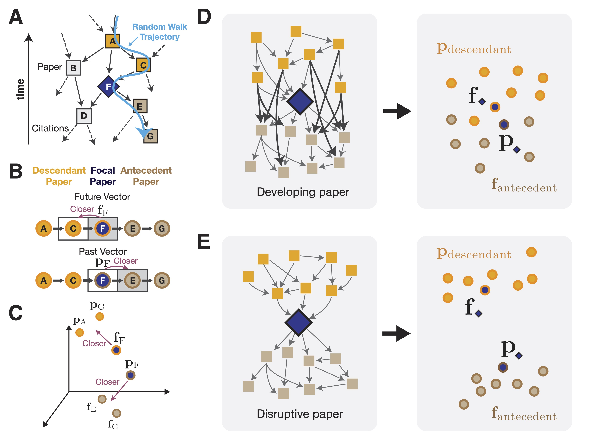

# embedding-disruptiveness

A Python package and workflow for measuring how disruptive a paper or patent is, using graph embeddings on citation networks.

This repository trains node2vec-style embeddings from citation graphs and computes an *Embedding Disruptiveness Measure (EDM)* that captures whether a work disrupts or consolidates its field. It also provides the classic *Disruption Index (DI)* as a built-in utility.

[**Paper**](https://doi.org/10.1126/sciadv.adx3420) | [**Blog Post**](https://munjungkim.github.io/embedding-disruptiveness-blog/)

---

## Table of Contents

- [How It Works](#how-it-works)
- [Environment Setup](#environment-setup)
- [Input Format](#input-format)
- [Usage with Snakemake](#usage-with-snakemake)
- [Usage without Snakemake](#usage-without-snakemake)
  - [Step 1: Embedding Calculation](#step-1-embedding-calculation)
  - [Step 2: Distance Calculation](#step-2-distance-calculation)
  - [Step 3: Disruption Index](#step-3-disruption-index)
- [pip Package](#pip-package)
- [Project Structure](#project-structure)
- [Authors](#authors)
- [Citation](#citation)
- [License](#license)

---

## How It Works

<p align="center">
  
</p>

1. **Random walks** traverse the citation graph, capturing both local and long-range structure (**A**).
2. A **directional skip-gram** model learns two vectors per paper: a *future vector* (influence on descendants) and a *past vector* (what it builds upon) (**B**, **C**).
3. The **cosine distance** between the two vectors is the Embedding Disruptiveness Measure — large gap means disruptive (**E**), small gap means consolidating (**D**).

For more details, see our [paper](https://doi.org/10.1126/sciadv.adx3420) and [blog post](https://munjungkim.github.io/embedding-disruptiveness-blog/).

---

## Environment Setup

### Using uv (recommended)

```bash
uv sync
source .venv/bin/activate
```

### Using pip

```bash
python -m venv .venv
source .venv/bin/activate
pip install -e ./libs/util -e ./libs/node2vec
pip install -e .
```

---

## Input Format

Your citation network should be a **scipy sparse matrix** saved as `.npz`. Rows and columns represent nodes (papers or patents), and non-zero entries represent citation edges.

```python
import scipy.sparse as sp

net = sp.csr_matrix(adjacency_data)
sp.save_npz("citation_net.npz", net)
```

---

## Usage with Snakemake

[Snakemake](https://snakemake.readthedocs.io/) automates the full pipeline — embedding, distance calculation, and disruption index computation. This is the recommended way to run the workflow since it handles parameter management and dependency resolution automatically.

From the `workflow/embedding_computation/` directory:

```bash
# Compute embedding distances for a specific configuration
snakemake '{data_dir}/{network_name}/{dim}_{win}_q_{q}_ep_{ep}_bs_{bs}_embedding/distance.npy' -j

# Run the full pipeline (all targets defined in the rule `all`)
snakemake -j
```

Snakemake resolves the dependency chain automatically:

1. **`embedding_all_network`** — trains node2vec embeddings, producing `in.npy` and `out.npy`
2. **`calculating_distance`** — computes cosine distances from the embedding vectors
3. **`calculating_disruption`** / **`calculating_disruption_nok`** / **`calculating_disruption_mutistep`** — computes disruption indices

Parameters (embedding dimension, window size, q, epochs, batch size, etc.) are configured in `config.yaml` and the Snakefile wildcards.

---

## Usage without Snakemake

### Step 1: Embedding Calculation

Train node2vec embeddings on a citation network:

```bash
python3 scripts/Embedding.py <network.npz> <dim> <window> <device1> <device2> <name> <q> <epochs> <batch_size> <work_dir>
```

| Parameter | Description |
|-----------|-------------|
| `network.npz` | Path to the citation network (scipy sparse `.npz`) |
| `dim` | Embedding dimension (e.g., `100`, `200`, `300`) |
| `window` | Context window size (e.g., `1`, `3`, `5`) |
| `device1` | CUDA device for in-vectors (e.g., `0`) |
| `device2` | CUDA device for out-vectors (e.g., `1`) |
| `name` | Network name identifier |
| `q` | Node2Vec return parameter |
| `epochs` | Number of training epochs |
| `batch_size` | Training batch size |
| `work_dir` | Working directory for output |

**Example:**

```bash
python3 scripts/Embedding.py /data/derived/APS/citation_net.npz 200 5 0 1 derived/APS 1 5 1024 /data
```

This saves in-vectors and out-vectors to:
- `{work_dir}/{name}/{dim}_{win}_q_{q}_ep_{ep}_bs_{bs}_embedding/in.npy`
- `{work_dir}/{name}/{dim}_{win}_q_{q}_ep_{ep}_bs_{bs}_embedding/out.npy`

### Step 2: Distance Calculation

Compute cosine distances from the embedding vectors:

```bash
python3 scripts/Distance_disruption.py distance <in.npy> <out.npy> <network.npz> <device> None
```

**Example:**

```bash
python3 scripts/Distance_disruption.py distance \
    /data/derived/APS/200_5_q_1_ep_5_bs_1024_embedding/in.npy \
    /data/derived/APS/200_5_q_1_ep_5_bs_1024_embedding/out.npy \
    /data/derived/APS/citation_net.npz \
    cuda:0 \
    None
```

### Step 3: Disruption Index

Compute the classic disruption index (and variants) from the citation network:

```bash
# First, generate reference/citation dictionaries
python3 scripts/reference_citation_dict.py <network.npz>

# Then compute disruption indices
python3 scripts/Distance_disruption.py disruption <ref_dict.pkl> <cit_dict.pkl> <network.npz> None None
python3 scripts/Distance_disruption.py disruption_nok <ref_dict.pkl> <cit_dict.pkl> <network.npz> None None
python3 scripts/Distance_disruption.py multistep <ref_dict.pkl> <cit_dict.pkl> <network.npz> None multistep
```

---

## pip Package

If you just want to compute EDM or the disruption index without the full workflow, we also provide a standalone pip package:

```bash
pip install embedding-disruptiveness
```

```python
import embedding_disruptiveness as edm

# Train embeddings
trainer = edm.EmbeddingTrainer(
    net_input="citation_network.npz",
    dim=128,
    window_size=5,
    device_in="0",
    device_out="1",
    q_value=1,
    epochs=5,
    batch_size=1024,
    save_dir="./output",
)
trainer.train()

# Or compute the classic disruption index directly
di = edm.calc_disruption_index(net)
di_2step = edm.calc_multistep_disruption_index(net)
```

- **Source code**: [github.com/MunjungKim/embedding-disruptiveness](https://github.com/MunjungKim/embedding-disruptiveness)
- **Example notebook**: [`notebooks/embedding-disruptiveness package.ipynb`](https://github.com/yy/embedding-disruptiveness/blob/main/notebooks/embedding-disruptiveness%20package.ipynb)

---

## Project Structure

```
├── workflow/embedding_computation/
│   ├── Snakefile              # Snakemake workflow definition
│   ├── config.yaml            # Workflow configuration
│   └── scripts/
│       ├── Embedding.py               # Node2Vec embedding training
│       ├── Distance_disruption.py     # Distance and disruption computation
│       ├── Configuration_network.py   # Random network generation
│       └── reference_citation_dict.py # Reference/citation dict builder
├── libs/
│   ├── node2vec/              # Node2Vec implementation (models, loss, datasets, random walks)
│   └── util/                  # Utility functions (data loading, disruption calculation)
├── notebooks/                 # Example notebooks
├── pyproject.toml             # Python dependencies and project metadata
├── uv.lock                    # Locked dependency versions
└── README.md
```

---

## Authors

- [Munjung Kim](https://github.com/MunjungKim)
- [Sadamori Kojaku](https://github.com/skojaku)
- [Yong-Yeol Ahn](https://github.com/yy)

## Citation

If you use this code in your research, please cite:

```bibtex
@article{kim2026uncovering,
  title={Uncovering simultaneous breakthroughs with a robust measure of disruptiveness},
  author={Kim, Munjung and Kojaku, Sadamori and Ahn, Yong-Yeol},
  journal={Science Advances},
  year={2026},
  doi={10.1126/sciadv.adx3420}
}
```

## License

MIT License. See [LICENSE](LICENSE) for details.
